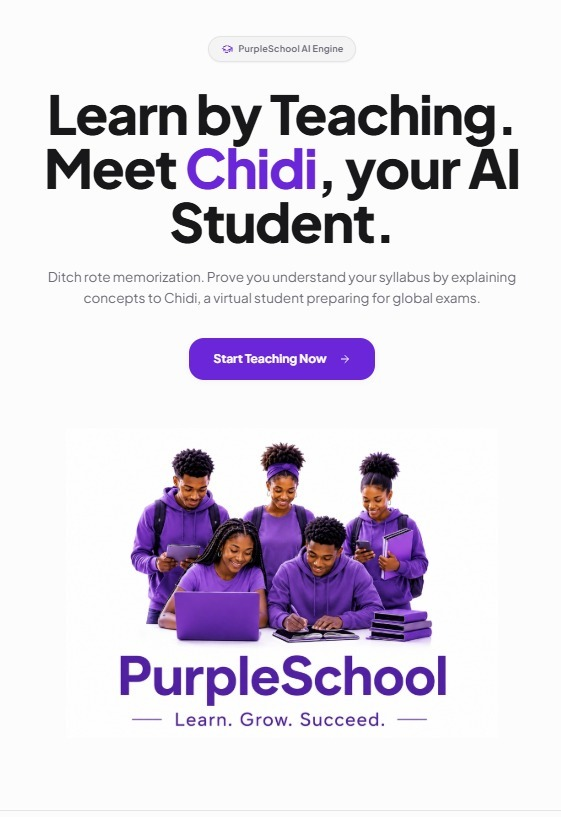

<div align="center">
  
  
  <h1>PurpleSchool</h1>
  <p><strong>Learn by Teaching. Meet Chidi, your AI Student.</strong></p>

  <p>
    <a href="#about-the-project">About</a> •
    <a href="#core-features">Features</a> •
    <a href="#tech-stack">Tech Stack</a> •
    <a href="#getting-started">Getting Started</a>
  </p>
</div>

---

## 📖 About the Project

Traditional education often relies on rote memorization, which leads to poor retention. **PurpleSchool** revolutionizes the learning process by digitizing the **Feynman Technique**: you prove you understand your syllabus by explaining concepts to **Chidi**, a virtual AI student preparing for global exams. 

When you teach, you uncover gaps in your own knowledge. Chidi will ask questions, seek clarifications, and challenge your understanding in real-time, helping you achieve true mastery of the subject matter.

## ✨ Core Features & Relevance

### 1. 🧠 AI Engine (Learn by Teaching)
- **Local AI execution:** Powered by WebLLM, Chidi runs directly in the browser for privacy, zero latency, and zero server costs.
- **Interactive Socratic Dialogue:** Chidi acts as an active learner, challenging the user to break down complex topics into simple, understandable analogies.
- **Relevance:** Transitions users from passive consumers of information to active masters of their syllabus.

### 2. 📡 Real-Time Live Classrooms
- **WebRTC Audio & Socket Signaling:** Students and teachers can jump into real-time audio rooms to collaborate.
- **Responsive & Accessible:** Custom-built layout that works flawlessly across desktops, tablets, and mobile devices (including a responsive header and tool layout).
- **Relevance:** Enables seamless peer-to-peer collaboration and remote study groups, essential for modern hybrid education.

### 3. 🎨 Collaborative Whiteboard (Tldraw)
- **Enterprise-Grade Synchronization:** Integrated the industry-standard `tldraw` engine with a custom, robust `useTLStore` synchronization pipeline.
- **Persistent Custom Toolbar:** A fully custom, mobile-friendly toolbar ensuring critical drawing tools (Pen, Eraser, Select, Undo/Redo) are always accessible and immune to inactivity timeouts.
- **Relevance:** Visual aids are crucial for explaining complex subjects like physics or math. The synchronous whiteboard allows multiple users to draw diagrams together in real-time.

### 4. 📊 Dashboard & Progress Tracking
- **Topic Mapping:** Users can navigate through structured subjects and topics (e.g., Biology, Mathematics).
- **Premium Content Gates:** Groundwork for premium subscription tiers, restricting advanced tools and subjects to paid users.
- **Relevance:** Keeps learners organized and provides a clear roadmap of their educational journey.

## 🛠 Tech Stack

PurpleSchool is built on a modern, high-performance web stack:

- **Frontend Framework:** React 19 + TypeScript + Vite
- **Styling:** Tailwind CSS + Radix UI Primitives + Framer Motion
- **State Management:** React Query
- **Real-time Communication:** Socket.io-client (Signaling) + WebRTC (Audio)
- **Whiteboard Engine:** Tldraw (`tldraw@5.3.0`)
- **AI Engine:** WebLLM (`@mlc-ai/web-llm`)
- **Testing:** Playwright

## 🚀 Getting Started

### Prerequisites
- Node.js (v18 or higher)
- npm or yarn

### Installation

1. **Clone the repository:**
   ```bash
   git clone https://github.com/93Chidiebere/purpleschools.git
   cd purpleschools
   ```

2. **Install dependencies:**
   ```bash
   npm install
   ```

3. **Start the development server:**
   ```bash
   npm run dev
   ```

4. **Build for production:**
   ```bash
   npm run build
   ```

## 📝 License

Distributed under the MIT License. See `LICENSE` for more information.

---

<div align="center">
  <sub>Built with ❤️ by the PurpleSchool Team</sub>
</div>
